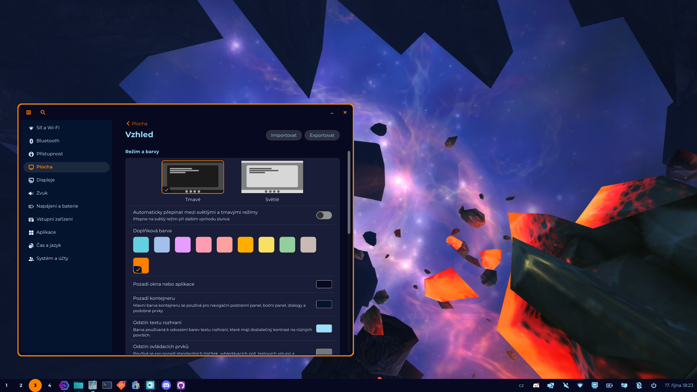
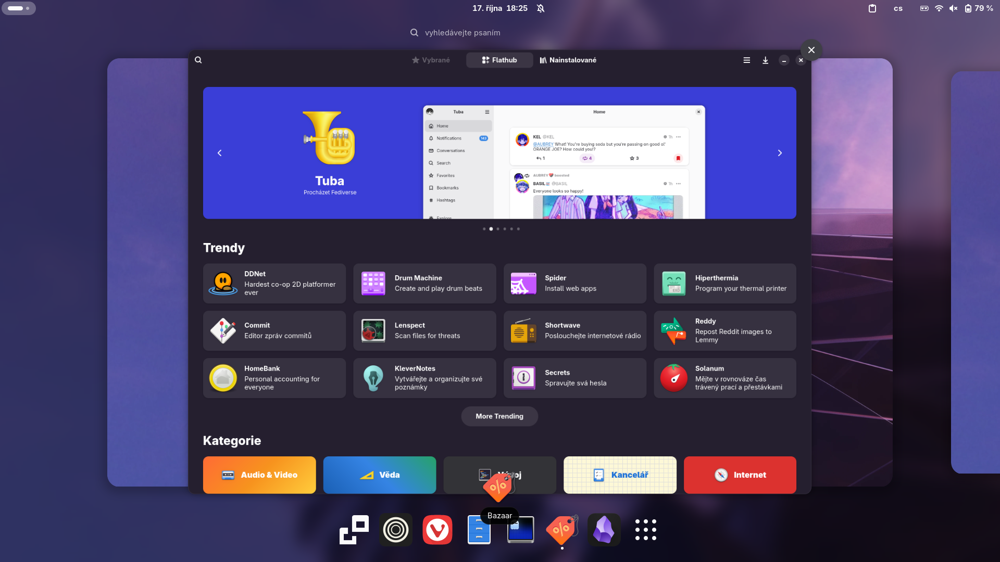

<div align="center">
 <h1>⚠️ THIS IMAGE IS CURRENTLY IN ALPHA ⚠️</h1>
 
</div>
<br>

Spacefin is custom Fedora Atomic image with COSMIC desktop installed. 

## Features

 - Latest or tagged cosmic desktop
 - Codecs and drivers out-of-the box
 - Custom just commands
 - Patched `switcheroo-control`, `mesa` and `xwayland`
 - Kernel with hardware patches and akmods
 - System76-schenduler enabled by default
 - Java preinstalled and set for running .jar files
 - Homebrew and Distrobox preinstalled
 - Custom COSMIC theme
    - with focus on tilling and minimalism
 - Preconfigured GNOME desktop
    - GSConnect set up by default
    - patches to enable fractional scalling, VRR and more
    - Preinstalled useful extensions
    - [Hanabi extension](https://github.com/jeffshee/gnome-ext-hanabi) for live wallpapers
 - Standalone COSMIC only image
 - "Hybrid" image with both COSMIC and GNOME
 - "Experimental" developer oriented image
    - Fish and zsh shells
    - Zed and VSCodium preinstalled and preconfigured
    - Restic and rclone
    - Waydroid for running Android apps
    - Scrcpy for mirroring Android screen

And coming soon:
 - Separate cosmic and gnome apps like Voyager OS does with XFCE

## Contributing

Ideas and pull requests are welcome 🎉. I would also appreciate a suggestion for a better name 😉.

## How to install

There are 3 variants: Main, hybrid and experimental.

Main image has only COSMIC desktop. You can rebase from Fedora Cosmic atomic with:

```bash
sudo bootc switch --enforce-container-sigpolicy ghcr.io/existingperson08/spacefin:latest
```

Hybrid image has COSMIC desktop and GNOME desktop. You can rebase from Bluefin or Fedora Silverblue with:

```bash
sudo bootc switch --enforce-container-sigpolicy ghcr.io/existingperson08/spacefin-hybrid:latest
```

Experimental image is developer oriented and has latest (nightly) Cosmic desktop from COPR and latest GNOME desktop from Fedora repos. You can rebase from Bluefin or Fedora Silverblue with:

```bash
sudo bootc switch --enforce-container-sigpolicy ghcr.io/existingperson08/spacefin-exp:latest
```

## Screenshots

<div align="center">

</div>
