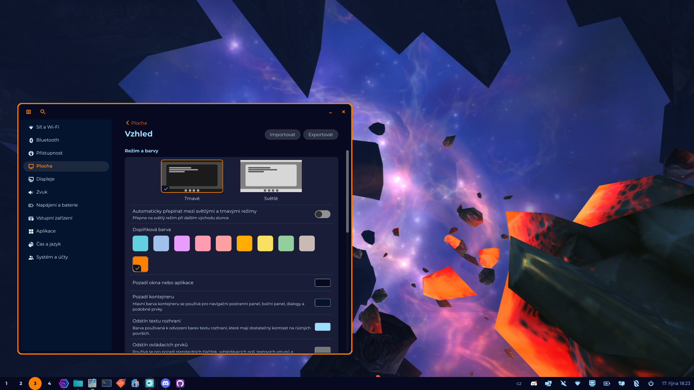
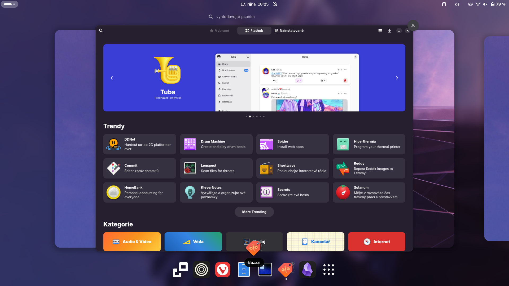
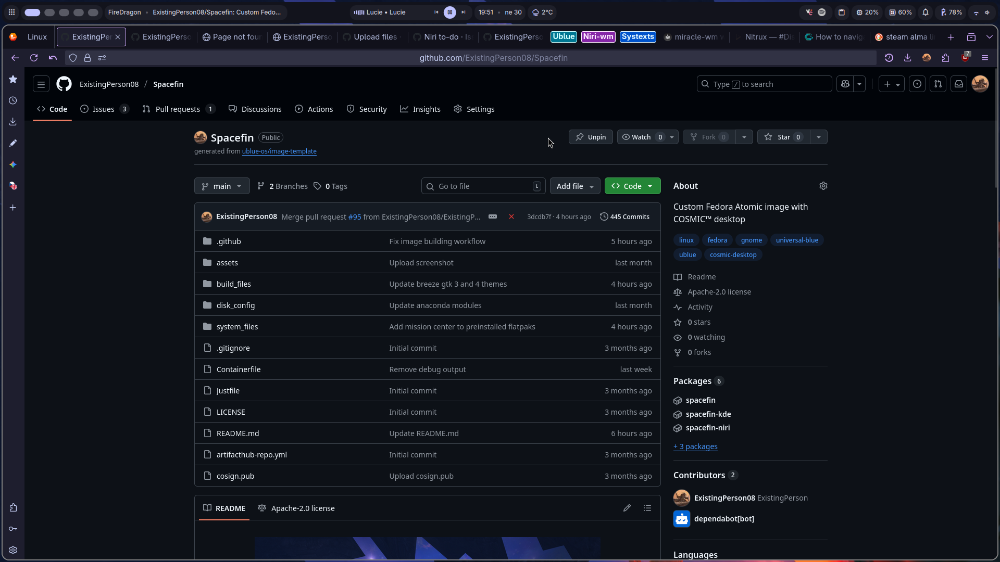

<div align="center">
 
</div>
<br>

Spacefin is my personal custom Arch bootc image with (not only) COSMIC desktop installed. **Note that this is WIP personal opinionated image so things are likely going to change or break!**

## Features

 - Cosmic or Gnome desktops or Niri wm
 - Automatic updates in background (WIP)
 - Codecs and drivers out-of-the box
 - Ananicy-cpp with [CachyOS's](https://github.com/CachyOS/ananicy-rules) and [custom](https://github.com/ExistingPerson08/ExistingRules) rules
 - Java preinstalled and set for running .jar files
 - Homebrew, Docker and Distrobox preinstalled
 - Restic and rclone out-of-the box
 - All shells (fish, bash, zsh) preinstalled
 - Gnome Boxes and quickemu for virtualization
 - CachyOS's optized repos and linux-zen kernel
 - Gaming stack (Steam, gamescope, gamescope session...)

## Desktops

### Main (Cosmic)

 - Custom COSMIC theme
 - Spacefin-cli for changing themes

If you want to install main eddition, rebase from Fedora Cosmic Atomic with:

```bash
sudo bootc switch --enforce-container-sigpolicy ghcr.io/existingperson08/spacefin-cosmic:latest
```

### GNOME

 - Preconfigured GNOME desktop
    - GSConnect set up by default
    - Layout customized for touchscreen
    - Preinstalled useful extensions

If you want to install GNOME eddition, rebase from Fedora Silverblue or Bluefin with:

```bash
sudo bootc switch --enforce-container-sigpolicy ghcr.io/existingperson08/spacefin-gnome:latest
```

### Niri

 - Preconfigured Niri setup
    - [Dank material shell](https://danklinux.com/)
    - All needed packages preinstalled
    - Fingerprint unlock preconfigured
 - Easy to customize

If you want to install Niri eddition, rebase from Fedora Silverblue or Bluefin with:

```bash
sudo bootc switch --enforce-container-sigpolicy ghcr.io/existingperson08/spacefin-niri:latest
```

## Screenshots

<div align="center">

<br><br>

</div>
